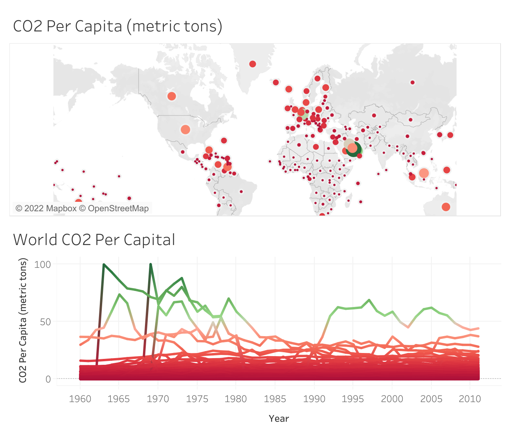

# Project 1

## [Physical activity monitoring](file:///Users/michaelolanipekun/Downloads/DataScienceRM_Report2.html)

Created a tool that  monitor Physical activity in wearable computing research.

collected publibly available data  PAMAP2 Physical Activity Monitoring dataset.

Datasets include the  measurements made by wireless sensors worn by 9 subjects as they performed various physical activities over time such as running, standing, or cycle. 

The  goal for this analysis is to build a model that can predict the given task a subject is performing based on a given measurement.

We performed Data preparation, cleaning, and exploration, is about making sure our data are ready for analysis; Which include dealing missing value denoted with 'NAN' as a result of Missing sensory data due to wireless data dropping. Also we performed Exploratory Data Analysis to help us better investigate our data set discover patterns and detect anomalies to help us formualte and test our hypothesis.Also, this section illustrates how to visualize data.

We fomulated and tested Hypothesis using statistical theories.

 We built both clasification and regression model using both  Linear Regression and Logistics Regression.
  
 # Project 2
 
The dashboard reveals the breakdown of world co2 emission by country and more importantly the per capita co2 emission by each country. It uses the data from the World Bank's Carbon Dioxide Information Analysis Center.
You can use the map to select a country or a group of countries then see how their co2 emission has changed over time.

